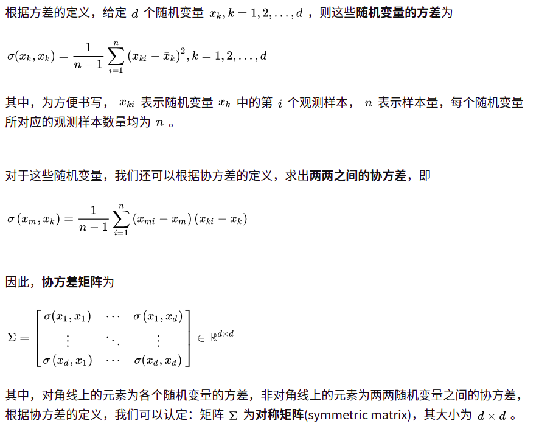

<!--
 * @Author: yinzhicun
 * @Date: 2021-03-29 20:39:08
 * @LastEditTime: 2021-03-30 09:55:15
 * @LastEditors: Please set LastEditors
 * @Description: In User Settings Edit
 * @FilePath: /Deep_learning/classification/note.md
-->
# 
Classification(分类)

## 简介

- 预设定相应的**函数模型**－*Model*
- 设定损失函数 －*Loss function*
- 求解最优的函数模型 －*Find the best function*
- 通过函数对其他输入的类别进行预测
- 与Regression不同的是，Classification会对函数的输出进行离散化处理，以满足其特殊的要求
- 针对Classification问题，课程中先提出了一种概率的解决方法

### 一、函数模型的定义

1. 设定有两个类别，分别为 $C_1$，$C_2$，我们需要进行分类的随机变量是 $x$，则 $x$ 属于 $C_1$ 类的概率为：
$$P(C_1|x)=\frac{P(x|C_1)P(C_1)}{P(x|C_1)P(C_1)+P(x|C_2)P(C_2)}$$

- 实际上 $x$ 在哪个类别中的概率最大，则属于哪个类别

2. 高斯分布：
$$f_{\mu,\Sigma}(x)=\frac{1}{(2\pi)^\frac{D}{2}}\frac{1}{|\Sigma|^\frac{1}{2}}e^{-\frac{1}{2}(x-\mu)^T\Sigma^{-1}(x-\mu)}$$
- $x$ 为随机变量的向量
- $\mu$ 为均值向量
- $\Sigma$ 为协方差矩阵

**注：多元正态分布的概率密度是由协方差矩阵的特征向量控制旋转(rotation)，特征值控制尺度(scale)，除了协方差矩阵，均值向量会控制概率密度的位置**

3. 实际上就是认为训练集中各类的数据服从高斯分布，则有：
$$Likelihood(\mu,\Sigma)=\sum_{i=1}^{n}{f_{\mu,\Sigma}(x^i)}$$

- 我们所期望的 $\mu$ 和 $\Sigma$ 就是让Likelihood最大的 $\mu$ 和 $\Sigma$

- 设让Likelihood最大的 $\mu$ 和 $\Sigma$ 为$\mu^*$ 和 $\Sigma^*$ ，则：
$$\mu^*=\frac{1}{n}\sum_{i=1}^nx^n$$
$$\Sigma^*=\frac{1}{n}\sum_{i=1}^n(x^n-\mu^*)(x^n-\mu^*)^T$$

