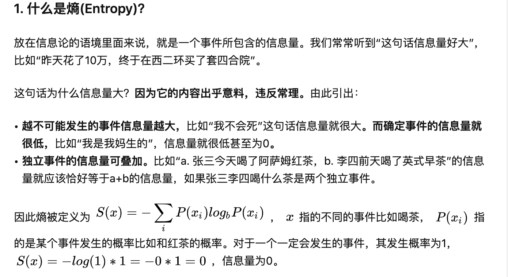
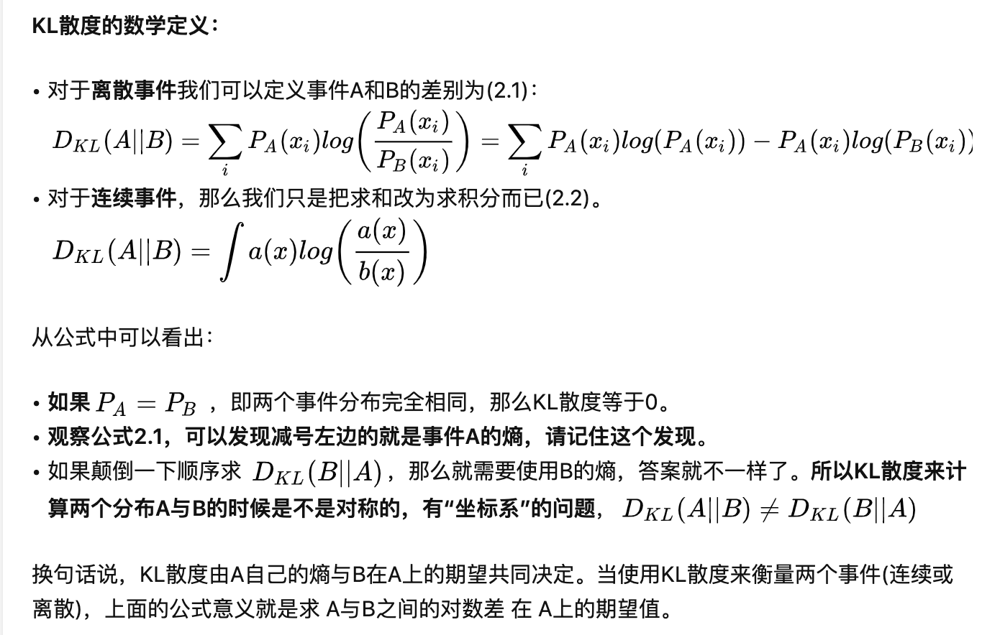
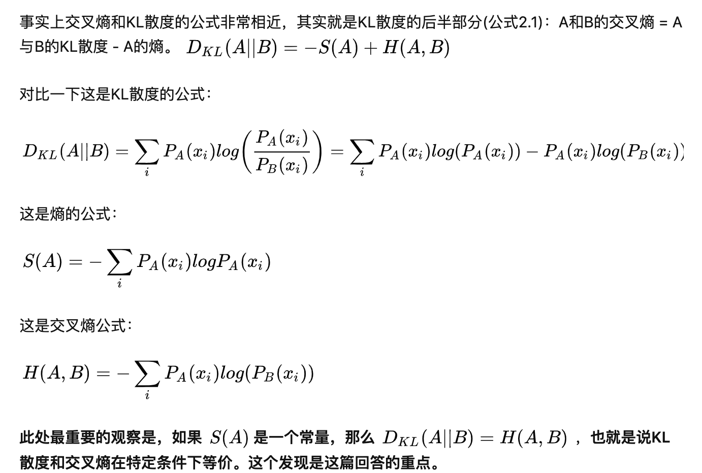
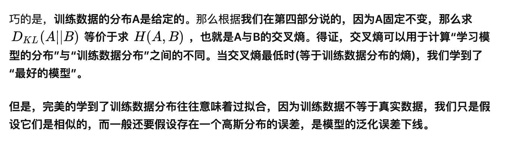

<!--
 * @Author: your name
 * @Date: 2021-04-03 09:29:50
 * @LastEditTime: 2021-04-03 11:05:15
 * @LastEditors: Please set LastEditors
 * @Description: In User Settings Edit
 * @FilePath: /Deep_learning/classification/note_logistic_regression.md
-->
# 
Logistic_Regression(逻辑回归)

## 简介

- 预设定相应的**函数模型**－*Model*
- 设定损失函数 －*Loss function*
- 求解最优的函数模型 －*Find the best function*
- 通过函数对未知数据的类别进行预测
- 基于概率分布的解决方法之上采用了回归模型

### 一、函数模型以及误差函数的定义

1. 以最简单的二元分类问题为例，设定有两个类别，分别为 $C_1$，$C_2$，我们需要进行分类的随机变量是 $x$，则 $x$ 属于 $C_1$ 类的概率为：
$$P(C_1|x)=\frac{P(x|C_1)P(C_1)}{P(x|C_1)P(C_1)+P(x|C_2)P(C_2)}$$
$$f(x)=\begin{cases} C_2\quad P(C_1|x)<0.5\\ C_1\quad P(C_1|x)>0.5  \end{cases}$$

- 这时代入classification中的计算模型，有：
$$\begin{aligned}
P(C_1|x)&=\frac{P(x|C_1)P(C_1)}{P(x|C_1)P(C_1)+P(x|C_2)P(C_2)}\\
&=\frac{1}{1+\frac{P(x|C_2)P(C_2)}{P(x|C_1)P(C_1)}}\\
&=\frac{1}{1+e^{-z}}\\
&=\sigma(z)
\end{aligned}$$
$$其中\ z=ln\frac{P(C_1|x)}{P(C_2|x)}=ln\frac{P(x|C_1)P(C_1)}{P(x|C_2)P(C_2)}$$

- 代入高斯分布函数有：
$$\begin{aligned}
z&=ln\frac{P(x|C_1)P(C_1)}{P(x|C_2)P(C_2)} \\ 
&=ln\frac{f_{\mu_1,\Sigma_1}(x)}{f_{\mu_2,\Sigma_2}(x)}+ln(\frac{P(C_1)}{P(C_2)})\\
&=-\frac{1}{2}x^T(\Sigma_1^{-1}-\Sigma_2^{-1})x+x^T(\Sigma_1^{-1}\mu_1-\Sigma_2^{-1}\mu_2)-\frac{1}{2}(\mu_1+\mu_2)\Sigma^{-1}(\mu_1-\mu_2)+\frac{1}{2}ln(\frac{|\Sigma_2|}{|\Sigma_1|})+ln(\frac{P(C_1)}{P(C_2)})
\end{aligned}$$

- 当两个分布具有相同的方差值时,在多维高斯分布中显示为两者的协方差矩阵相同，这时：
$$\Sigma_1=\Sigma_2=\Sigma$$
$$\begin{aligned}
代入上式则：z&=x^T\Sigma^{-1}(\mu_1-\mu_2)-\frac{1}{2}(\mu_1+\mu_2)\Sigma^{-1}(\mu_1-\mu_2)+ln(\frac{P(C_1)}{P(C_2)})\\
&=(\mu_1-\mu_2)^T\Sigma^{-1}x-\frac{1}{2}(\mu_1+\mu_2)\Sigma^{-1}(\mu_1-\mu_2)+ln(\frac{P(C_1)}{P(C_2)})\\
&=w^Tx+b
\end{aligned}$$
$$其中\ w=(\mu_1-\mu_2)^T\Sigma^{-1}$$
$$而\ b=\frac{1}{2}(\mu_1+\mu_2)\Sigma^{-1}(\mu_1-\mu_2)+ln(\frac{P(C_1)}{P(C_2)})$$

- 写成非向量形式：
$$z=\sum_{i=1}^n{\omega_{i}\cdot\ x_{i}}+b$$
- 所以可得：
$$\begin{aligned}
P(C_1|x)&=f(x)\\
&=\sigma(z)\\
&=\frac{1}{1+e^{-(\sum_{i=1}^n{\omega_{i}\cdot\ x_{i}}+b)}}
\end{aligned}$$
  
- 到了这里就可以 $w$ 和 $b$ 为参数进行回归运算，如果以**网络**的思想来看的话，就是在一层全联接层之后又加上了一个**sigmod的激活函数**将输入限制再在(0,1)中

2. 定义误差函数：
$$Likelihood(f)=\sum_{i=1}^{k}{f(x^i)}\cdot\sum_{i=k+1}^{n}{(1-f(x^i))}$$
- 其中 $x$ 为随机变量
- $f(x)$ 为 $P(C_1|x)$，$1-f(x)$ 为 $P(C_2|x)$
- 1-k组的训练数据是 $C_1$ 一类的，而k+1-n组得训练数据是 $C_2$ 一类的
- 实际上就是寻找使训练集分类正确可能性最大的分布

### 二、求解函数参数

1. ***cross entropy*** 交叉熵:

图片均取自知乎（https://www.zhihu.com/question/65288314/answer/244557337）

2.
### 三、线性分类判别与二次分类判别
1. 线性分类判别（**LDA**）：一定程度上简化模型，抑制overfitting

$$\begin{aligned}
P(C_1|x)&=\frac{P(x|C_1)P(C_1)}{P(x|C_1)P(C_1)+P(x|C_2)P(C_2)}\\
&=\frac{1}{1+\frac{P(x|C_1)P(C_1)}{P(x|C_2)P(C_2)}}\\
&=\frac{1}{1+e^{-z}}\\
&=\sigma(z)
\end{aligned}$$
$$z=ln\frac{P(C_1|x)}{P(C_2|x)}=ln\frac{P(x|C_1)P(C_1)}{P(x|C_2)P(C_2)}$$
- 当两个分布具有相同的方差值时,在多维高斯分布中显示为两者的协方差矩阵相同，这时：
$$\begin{aligned}
z=ln\frac{P(C_1|x)}{P(C_2|x)}&=ln\frac{P(x|C_1)P(C_1)}{P(x|C_2)P(C_2)} \\ 
&=ln\frac{f_{\mu_1,\Sigma}(x)}{f_{\mu_2,\Sigma}(x)}+ln(\frac{P(C_1)}{P(C_2)})\\
&=x^T\Sigma^{-1}(\mu_1-\mu_2)-\frac{1}{2}(\mu_1+\mu_2)\Sigma^{-1}(\mu_1-\mu_2)+ln(\frac{P(C_1)}{P(C_2)})
\end{aligned}$$
- 可以发现上式是性的，也就是 $P(C_1|x)=P(C_2|x)$ 时边界条件是线性的，即划分两个类别区域的分界线为直线

1. 二次分类判别（**QDA**）:

- 此时两个分布方差值不同，这时有分类判别函数：
$$\begin{aligned}
ln\frac{P(C_1|x)}{P(C_2|x)}&=ln\frac{P(x|C_1)P(C_1)}{P(x|C_2)P(C_2)} \\ 
&=ln\frac{f_{\mu_1,\Sigma_1}(x)}{f_{\mu_2,\Sigma_2}(x)}+ln(\frac{P(C_1)}{P(C_2)})\\
&=-\frac{1}{2}x^T(\Sigma_1^{-1}-\Sigma_2^{-1})x+x^T(\Sigma_1^{-1}\mu_1-\Sigma_2^{-1}\mu_2)-\frac{1}{2}(\mu_1+\mu_2)\Sigma^{-1}(\mu_1-\mu_2)-\frac{1}{4}ln(\frac{|\Sigma_2|}{|\Sigma_1|})+ln(\frac{P(C_1)}{P(C_2)})
\end{aligned}$$

- 可以发现上式是非线性的，也就是 $P(C_1|x)=P(C_2|x)$ 时边界条件是二次型，即划分两个类别区域的分界线为曲线

3. 通过 **LDA** 简化上述模型，即令两个分布的协方差矩阵相等

- 此时误差函数为

$$Likelihood(\mu_1,\mu_2,\Sigma)=\sum_{i=1}^{k}{f_{\mu_1,\Sigma}(x^i)}+\sum_{i=k+1}^{n}{f_{\mu_2,\Sigma}(x^i)}$$

- 最大化概率求解
$$MAX\ Likelihood(\mu_1,\mu_2,\Sigma)=\sum_{i=1}^{k}{f_{\mu_1,\Sigma}(x^i)}+\sum_{i=k+1}^{n}{f_{\mu_2,\Sigma}(x^i)}$$

- 设让Likelihood最大的 $\mu$ 和 $\Sigma$ 为$\mu_1^*$，$\mu_2^*$ 和 $\Sigma^*$ ，则：
$$\mu_1^*=\frac{1}{k}\sum_{i=1}^kx^i$$
$$\mu_2^*=\frac{1}{n-k}\sum_{i=k+1}^nx^i$$
$$\Sigma_1=\frac{1}{k}\sum_{i=1}^j(x^i-\mu_1^*)(x^i-\mu1^*)^T$$
$$\Sigma_2=\frac{1}{n-k}\sum_{i=k+1}^n(x^i-\mu_2^*)(x^i-\mu2^*)^T$$
$$\Sigma^*=\frac{k}{n}\Sigma_1+\frac{n-k}{n}\Sigma_2$$

### 四、其他
1. 当多维正太分布的特征的每一个分量相互**独立**时，可以看做多个一维的高斯分布的组合，采用**朴素贝叶斯分类方法**
