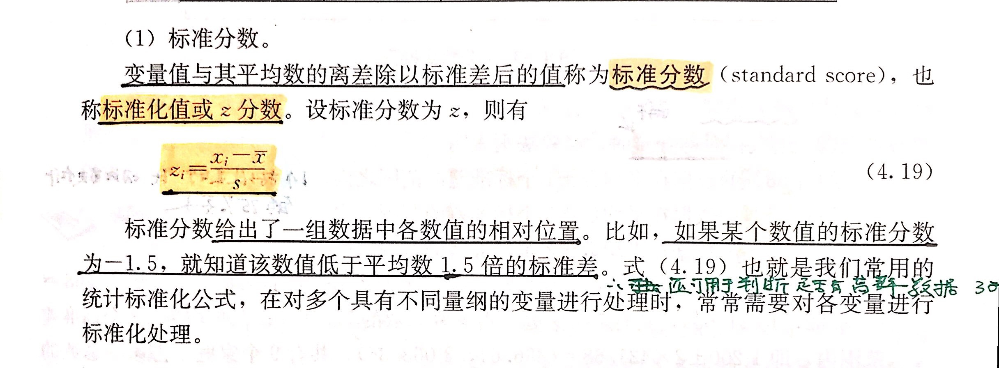

<!--
 * @Author: your name
 * @Date: 2021-03-27 22:45:54
 * @LastEditTime: 2021-03-29 09:59:44
 * @LastEditors: Please set LastEditors
 * @Description: In User Settings Edit
 * @FilePath: /deep_learing/regression/note.md
-->

# 
Regression (回归)

## 简介

回归的步骤实际上就是：

- 预设定相应的**函数模型**
- 通过已有的数据求解函数的参数，得到函数的关系式
- 对未知的数据进行预测。

### 一、函数模型的定义

1. 定义线性模型：
   $$y=\sum_{i=1}^n{\omega_{i}\cdot\ x_{i}}+b$$
2. 定义误差函数：
   $$L(f)=\sum_{i=1}^n(\hat{y}^i-\sum_{j=1}^k\omega_j\cdot\ x_j^i-b)^2$$

- $\hat{y}^i$ 代表用来预测函数的第 $i$ 组数据的目标值
- $x^i_j$ 表示用来预测函数的第 $i$ 组数据的第 $j$ 个参数值
- $\omega_j$ 为第 $j$ 个参数值的权重

很显而易见的是 $L(f)$ 是关于 $\omega$ 和 $b$ 的函数。我们要做的就是调整 $\omega$ 和 $b$ 让误差函数最小。

### 二、求解函数参数

1. 设置函数模型为一个参数值的简单模型：
$$y=\omega\cdot x+b$$

2. 可得误差函数为：
$$L(\omega,b)=\sum_{i=1}^n(\hat{y}^i-(\omega\cdot x^i+b))^2$$

3. 采用梯度下降法求解
$$\frac{\partial{L}}{\partial{\omega}}=2\sum_{i=1}^n(\hat{y}^i-(\omega\cdot x^i+b))\cdot (-x^i)$$
$$\frac{\partial{L}}{\partial{b}}=2\sum_{i=1}^n(\hat{y}^i-(\omega\cdot x^i+b))\cdot (-1)$$

&emsp; 则有:

$$\omega^{i}=\omega^{i-1}-\eta\frac{\partial{L}}{\partial{\omega}}{|}_{\omega=\omega^{i-1},b=b^{i-1}}$$

$${b}^{i}=b^{i-1}-\eta\frac{\partial{L}}{\partial{b}}{|}_{\omega=\omega^{i-1},b=b^{i-1}}$$

&emsp; 其中 $i\ge1$, $\eta$ 为学习率 (自己设定),写成矩阵的形式如下:
$$A=[  \omega \ b]^T$$
$$\nabla{L}=[\frac{\partial{L}}{\partial{\omega}}\  \frac{\partial{L}}{\partial{b}}]^T$$

&emsp; 则有:
$$A^i=A^{i-1}-\eta\nabla{L}$$

**注:以上均采用简单的线性模型进行推导,非线性函数推导过程类似**

### 三、评价求解出的模型

1. 最直观的方法是采用优化完成之后误差函数的稳态值的大小来直接估计模型的好坏,一般来说,误差函数值越小,模型越好,但是由于**过拟合**问题的存在导致该值不适合作为标准.**所以一般使用测试集的误差来对模型进行评估**.
- 选择测试集的三种方法: 留出法,交叉验证法,自助法
   
2. 问题之一 ***overfitting*** 把训练样本自身的一些特点当做了所有潜在样本的一般性质,导致泛化性能下降,他也是机器学习中所遇到的**关键障碍**.
- 实质是模型的 ***variance*** 偏大.一般现象是在 training_data 上有较好的效果,而在 testing_data上却效果不佳. 
- 解决方法之一: Regularization (正则化)

&emsp;&emsp;也就是改写损失函数为:
$$L(\omega,b)=\sum_{i=1}^n(\hat{y}^i-(\omega\cdot x^i+b))^2+\lambda\sum_{i=1}^n\omega^2$$
&emsp;&emsp;**注: 不需要考虑b项,但是正则化在消除 variance 的过程中会损伤到 bias**

3. 问题之二 ***underfitting*** 是指训练样本自身的特点没有学习到位.
- 实质上是模型的 ***bias*** 偏大.一般现象为模型对 training_data 的拟合就效果不好.

### 四、优化梯度下降法
1. **Adagrad**: 优化 $\eta$ 值 
- 由于一般来说 $\eta$ 会随着像最优点的靠近越来越小所以：
$$\omega^{t+1}=\omega^t-\eta^t\nabla{L}^t$$
$$其中\quad\eta^t = \frac{\eta}{\sqrt{t+1}}$$

- 用对一次微分的二范数来代替难以计算的二次微分
$$\omega^{t+1}=\omega^t-\frac{\eta}{\sqrt{\sum_{i=0}^t(\nabla{L}^i)^2}}\nabla{L}^t$$

2. **SGD**:  每次只取一个或一部分样本进行优化,来增加计算速度

3. **Feature_Scaling** 让 $x_1,x_2,...,x_n$ 的值归一化，使他们的尺度保持一致，一般采取方式为计算**标准分数**
$$x_{ij}=\frac{x_{ij}-mean(x_j)}{std(x_j)}$$ 
- $mean(x_j)$ 为对第 $j$ 组参数取平均值
- $std(x_j)$ 为对第 $j$ 组参数取标准差

